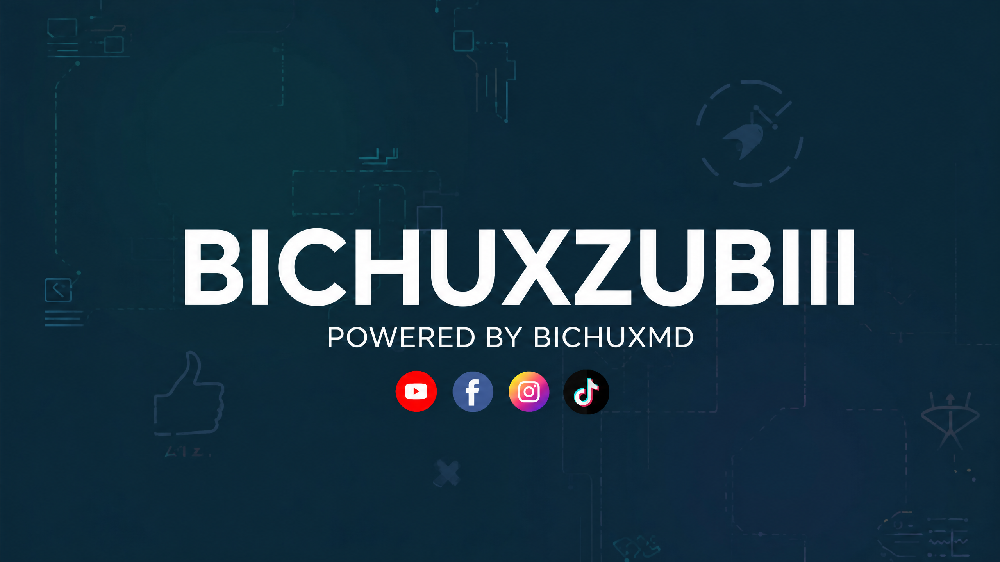
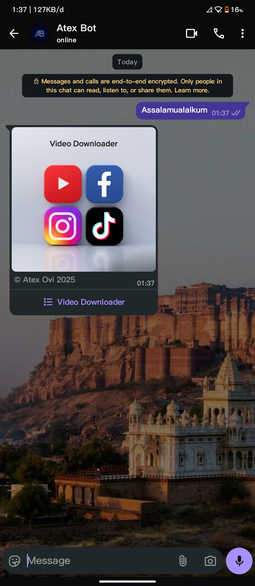
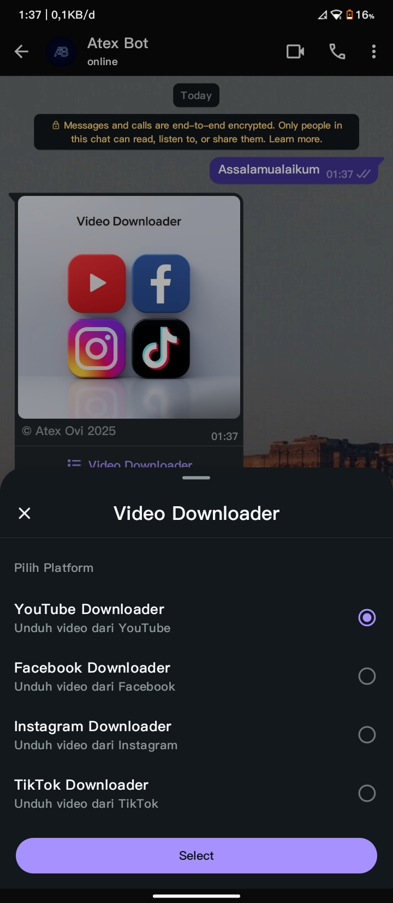
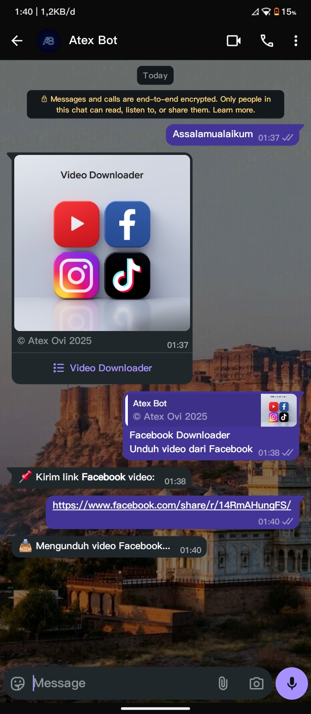
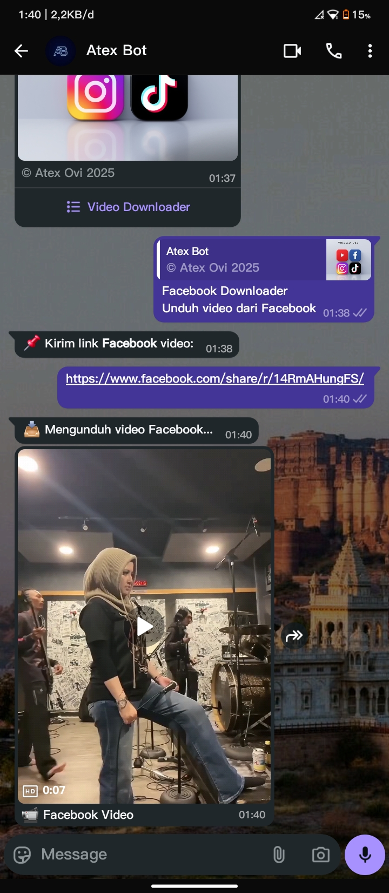

<h1 align="center" style="font-size:72px;">
  BICHUXZUBIII - WhatsApp Bot
</h1>
<br>

<p align="center">

  <!-- 🔹 BARIS 1 — PACKAGE INFO -->
  <a href="https://www.npmjs.com/package/atexovi-baileys" target="_blank">
    
  </a>
  <a href="https://nodejs.org/en/" target="_blank">
    
  </a>
  <a href="https://github.com/atex-ovi/BICHUXZUBIII/blob/main/LICENSE" target="_blank">
    
  </a>

  <br>

  <a href="https://t.me/atexovi" target="_blank">
    
  </a>
  <a href="https://facebook.com/atex.ovi" target="_blank">
    
  </a>

</p>

<br>

<p align="center">
  
</p>

<p align="center">
  <strong style="font-size:24px;">
    BICHUXZUBIII is an interactive WhatsApp bot based on 
    <a href="https://www.npmjs.com/package/atexovi-baileys">atexovi-baileys</a>. 
    This bot provides a clean interface for downloading videos from multiple platforms.
  </strong>
</p>

<br>

## Features

<table>
  <tr>
    <td width="40"></td>
    <td style="font-size:20px;"><strong>YouTube Downloader</strong> – Download YouTube videos directly via WhatsApp</td>
  </tr>
  <tr>
    <td></td>
    <td style="font-size:20px;"><strong>Facebook Downloader</strong> – Download videos from Facebook links</td>
  </tr>
  <tr>
    <td></td>
    <td style="font-size:20px;"><strong>Instagram Downloader</strong> – Download Instagram media easily</td>
  </tr>
  <tr>
    <td></td>
    <td style="font-size:20px;"><strong>TikTok Downloader</strong> – Download TikTok videos without watermark</td>
  </tr>
</table>

<br>

## Demo / Screenshot

<table>
  <tr>
    <td></td>
    <td></td>
    <td></td>
    <td></td>
  </tr>
</table>

<br>

## 🧰 Installation

> [!NOTE]
> Follow these instructions to set up **BICHUXZUBIII** on **[Termux](https://termux.dev/en/)** (Android), Windows, or Linux.

<br>

### 🧩 Prerequisites

Before installing, make sure your system has:

- **Node.js >= 20**  
  ```bash
  node -v
  ```
- **npm** (comes with Node.js)  
  ```bash
  npm -v
  ```
- **Git**  
  ```bash
  git --version
  ```
- Stable internet connection.

<br>

### 📱 Termux (Android)

1. Update and install dependencies:

```bash
pkg update && pkg upgrade
pkg install nodejs git
```

2. Clone the repository:

```bash
git clone https://github.com/atex-ovi/BICHUXZUBIII.git
cd BICHUXZUBIII
```

3. Install Node.js dependencies:

```bash
npm install
```

4. Run the bot:

```bash
npm start
```

<br>

### 🖥️ Windows / Linux

1. Install Node.js & Git  
   - Windows: [Node.js LTS](https://nodejs.org) and [Git](https://git-scm.com/download/win)  
   - Linux: `sudo apt install nodejs npm git`

2. Clone the repository:

```bash
git clone https://github.com/atex-ovi/BICHUXZUBIII.git
cd BICHUXZUBIII
```

3. Install dependencies:

```bash
npm install
```

4. Run the bot:

```bash
npm start
```

> [!NOTE]
> The `session/` folder will be created automatically to store authentication. Always follow the pairing code instructions in the terminal.

<br>

### ⚡ Quick Start (***Fast Alternative***)
If you already have Node.js (v20+) and Git, just run:

```bash
git clone https://github.com/atex-ovi/BICHUXZUBIII.git
cd BICHUXZUBIII
npm install
npm start

```
> [!TIP]
> Follow the pairing code that appears in the terminal to connect WhatsApp.

<br>

## 📌 Compatibility

| Platform | Status | Notes / Recommendation |
|-----------|---------|-----------------------|
| <span> WhatsApp Messenger</span> | 🟢 **Stable** | Recommended for clean usage, no extra logs |
| <span> WhatsApp Business</span> | 🟠 _Works normally_ | May display internal session/debug logs |

<br>

## 📂 Directory Structure

```
BICHUXZUBIII/
├── LICENSE
├── README.md
├── SECURITY.md
├── index.js
├── package.json
└── src
    ├── assets
    │   └── menu.jpg         # Image used for the main menu
    ├── features
    │   ├── facebook.js      # Facebook downloader logic
    │   ├── instagram.js     # Instagram downloader logic
    │   ├── tiktok.js        # TikTok downloader logic
    │   └── youtube.js       # YouTube downloader logic
    ├── handler.js           # Main message handler
    ├── userState.js         # Stores user session states
    └── utils
        ├── typing.js        # Wrapper for sendMessage with typing simulation
        └── validateUrl.js   # URL validation utility
```

> [!TIP]
> You can customize each feature module or add new downloaders by following the existing module pattern.

<br><br>

> [!CAUTION]
> WhatsApp is a trademark of WhatsApp Inc.
> 
> This bot uses the [**atexovi-baileys**](https://www.npmjs.com/package/atexovi-baileys) library, which is open-source and unofficial.
> 
> Use this bot at your own risk and avoid spam or abuse.

<br>

## Special Thanks
- [WhatsApp API](https://www.whatsapp.com) - WhatsApp's official messaging technology.
- [adiwajshing (Baileys)](https://github.com/adiwajshing) - Baileys library developer for WhatsApp API.
- [WhiskeySockets Baileys](https://github.com/WhiskeySockets) - additional contributions to Baileys.

<br>

## Support & Donations
If you find this project useful, consider supporting the development:

[](https://buymeacoffee.com/atexovi)

<br>

## License

This project is licensed under the [MIT](LICENSE).

## YouTube Title Search and Quality Selection

From the BICHUXZUBIII menu, choose **YouTube Downloader**. You can now send either a YouTube link or the video title. If you send a title, the bot searches YouTube and shows up to five results in an interactive list. Select the desired result, then choose **Audio MP3**, **Video up to 4K**, **Video 1440p**, or **Video 1080p**.

The 4K option requests the highest available video quality up to 2160p and falls back to a lower quality when the source video does not provide 4K. Audio and video availability also depends on the source, restrictions, network, and installed `yt-dlp` runtime. Use this feature only for content you are authorized to download.

## Final BICHUXZUBIII Features

The bot is branded as **𝐁𝐈𝐂𝐇𝐔𝐗𝐙𝐔𝐁𝐈𝐈𝐈** with **POWERED BY BICHUXMD** branding. It provides TikTok, Instagram, and Facebook video downloading where the source permits direct media access, plus a YouTube workflow with link or title search.

For YouTube, send a link or type a song, movie, or video title. The bot shows search results, then lets the user choose Audio MP3, Video up to 4K, 1440p, or 1080p. The 4K option means up to 2160p and falls back when the source does not provide 4K. Use the bot only for media you are authorized to download and respect the terms of each platform.

## Railway Deployment and Web Pairing

1. Upload this project to a private GitHub repository.
2. In Railway, create a new project and deploy from that GitHub repository.
3. Railway detects Node.js from `package.json`; use `npm install` as the build command if Railway asks for one and `npm start` as the start command.
4. Generate a public domain in Railway. The pairing page will be available at `https://YOUR-DOMAIN/pair`.
5. On the pairing page, enter the WhatsApp number with country code but without `+`, spaces, or dashes. The page displays the **BICH-UXMD** pairing label and the actual WhatsApp pairing code.
6. In WhatsApp, open **Settings → Linked devices → Link a device → Link with phone number**, then enter the code.

For reliable session persistence, attach a Railway volume and set `SESSION_DIR=/data` when the volume is mounted at `/data`. Without persistent storage, the WhatsApp session can be lost after a redeploy or restart. Keep the pairing page private or protect it before sharing it publicly; never publish session files, `.env` files, or pairing codes.

The service binds to Railway's `PORT` on `0.0.0.0`, and the root URL redirects to `/pair`. The status endpoint is `/pair/status`.
